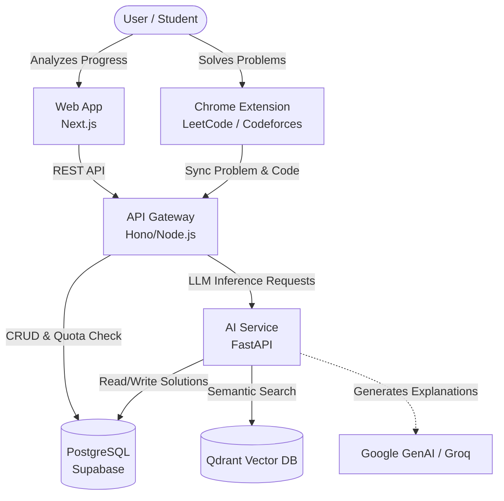

# Placement Prep Platform

Placement Prep is an advanced, AI-powered coding interview preparation platform. It seamlessly bridges the gap between practicing on standard competitive programming platforms (like LeetCode and Codeforces) and getting deep, personalized AI coaching.

The platform leverages a microservices architecture, featuring a modern web dashboard, a fast API gateway, a dedicated Python AI service for Large Language Model (LLM) orchestration, and a Chrome Extension to automatically sync user submissions.

## Key Features

- **Seamless Synchronization:** Chrome extension automatically extracts problems and code submissions from LeetCode and Codeforces.
- **AI-Powered Coaching:** Generates relatable real-world analogies, step-by-step approaches, and dry-run traces for any coding problem.
- **Progressive Hint System:** Provides tiered hints (from vague nudges to near-pseudocode) without spoiling the answer.
- **Deep Complexity Analysis:** Line-by-line Big-O time and space complexity audits for user submissions.
- **Smart Recommendations:** Uses vector search to recommend the most logical follow-up problems.

## Architecture

The project is structured as a monorepo managed by [Turborepo](https://turbo.build/repo).

### High-Level Flow



### Directory Structure

```text
placement-prep/
├── apps/
│   ├── ai-service/   # Python/FastAPI service for LLM tasks
│   ├── api/          # Node.js/Hono API gateway
│   ├── extension/    # Chrome Extension for scraping & sync
│   └── web/          # Next.js web dashboard
├── infrastructure/   # Dockerfiles and deployment config
├── docker-compose.yml# Local development orchestration
├── package.json      # Root package and monorepo scripts
└── turbo.json        # Turborepo configuration
```

## Tech Stack

- **Monorepo:** Turborepo, npm workspaces
- **Frontend (`apps/web`):** Next.js 14, React 19, Tailwind CSS v4, GSAP, Recharts, Clerk Auth
- **API (`apps/api`):** Node.js, Hono, TypeScript, Supabase JS Client, Razorpay
- **AI Service (`apps/ai-service`):** Python, FastAPI, Google GenAI, Groq, SentenceTransformers, curl_cffi
- **Extension (`apps/extension`):** Manifest V3 Chrome Extension (Vanilla JS)
- **Databases:** PostgreSQL (via Supabase), Qdrant (Vector Database via Docker)

## Prerequisites

- **Node.js:** v20+ (with `npm@10+`)
- **Python:** 3.10+
- **Docker & Docker Compose:** For running local Qdrant and PostgreSQL databases
- **API Keys:** Supabase, Clerk, Gemini API, Groq

## Getting Started

### 1. Clone the Repository

```bash
git clone https://github.com/your-org/placement-prep.git
cd placement-prep
```

### 2. Install Dependencies

Install all JavaScript/TypeScript dependencies across the monorepo:

```bash
npm install
```

### 3. Start Infrastructure

Start the local PostgreSQL database and Qdrant vector database using Docker Compose:

```bash
docker-compose up -d postgres qdrant
```

### 4. Environment Variables

Create a `.env` file in the root (or individually in `apps/api`, `apps/web`, `apps/ai-service`) based on the provided `.env.example`. Ensure you populate:

- Supabase URL & Anon Key
- Clerk Frontend & Backend Keys
- Gemini API Key (`GEMINI_API_KEY`)
- Internal Service Key (`INTERNAL_SERVICE_KEY`) used between `api` and `ai-service`.

### 5. Run Development Servers

Using Turborepo, you can spin up all development servers (Web, API, and AI Service if integrated) concurrently:

```bash
npm run dev
```

This command maps to `turbo run dev --parallel`.

Alternatively, run them manually in separate terminal windows:

- **Web:** `cd apps/web && npm run dev` (Runs on http://localhost:3000)
- **API:** `cd apps/api && npm run dev` (Runs on http://localhost:3001)
- **AI Service:** `cd apps/ai-service && uvicorn app.main:app --reload` (Runs on http://localhost:8000)

### 6. Chrome Extension Setup

1. Open Google Chrome and navigate to `chrome://extensions/`
2. Enable **Developer mode** in the top right.
3. Click **Load unpacked** and select the `apps/extension` directory.

## Testing & Linting

```bash
# Run linting across all packages
npm run lint

# Run type-checking and tests
npm run test
```

## Deployment

The services are containerized via the `infrastructure/docker/` directory.

- **Web & API:** Can be deployed to Vercel, Railway, or Render.
- **AI Service:** Can be deployed to Render, Fly.io, or Google Cloud Run using the `ai-service.Dockerfile`.
- **Databases:** Use managed Supabase for PostgreSQL and managed Qdrant Cloud.
